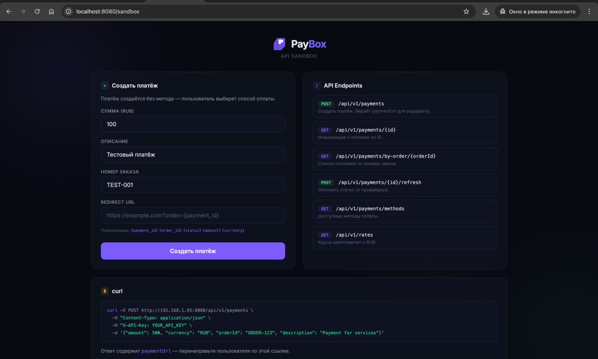
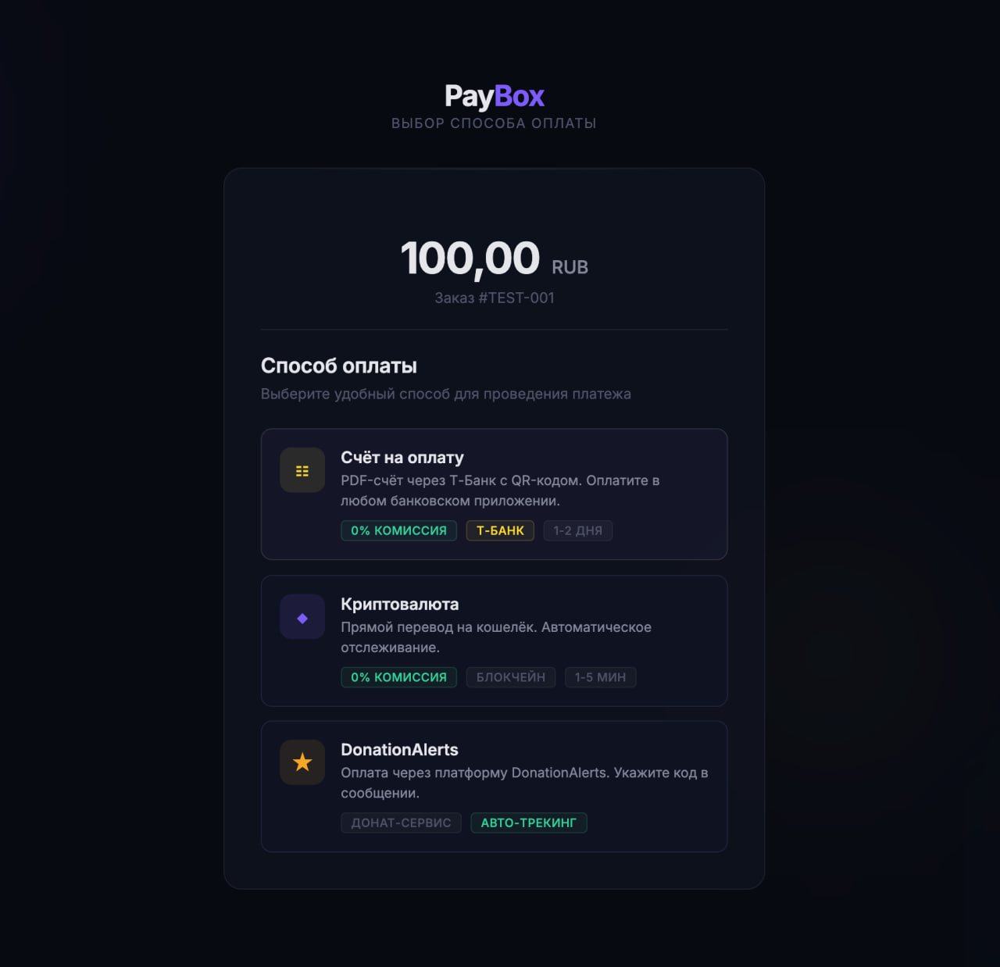
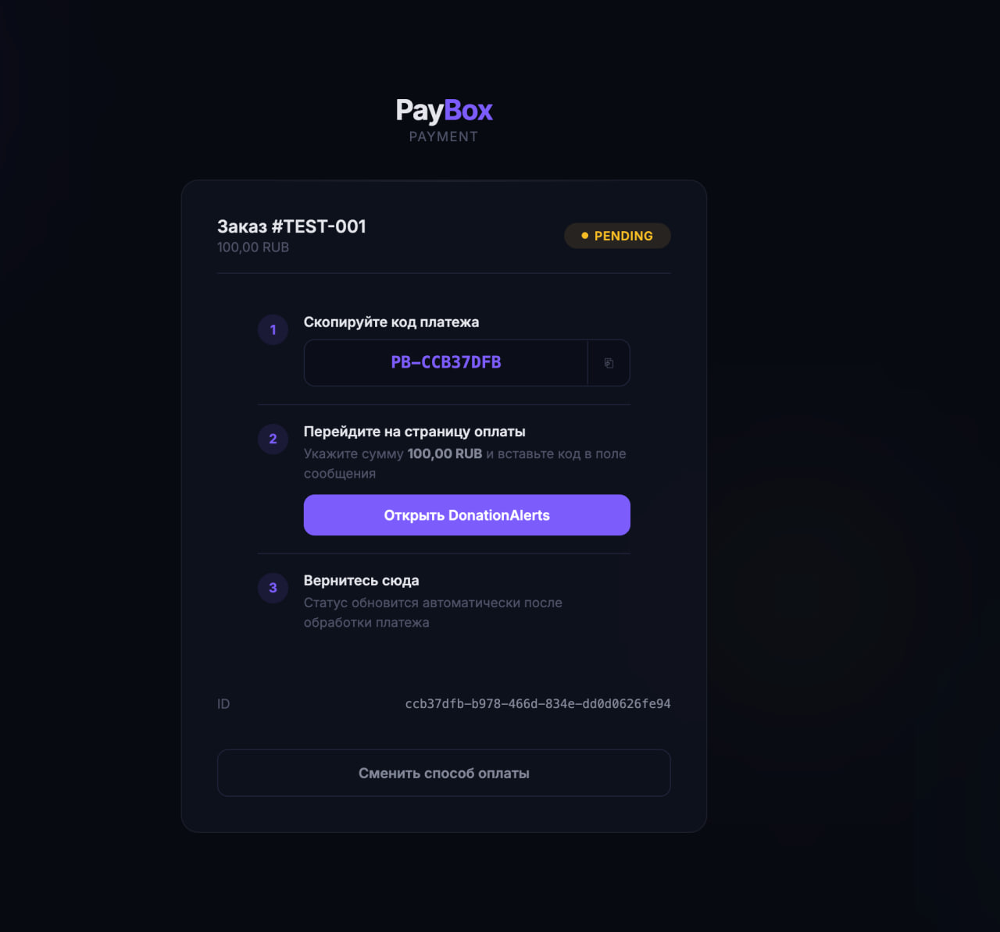

<p align="center">
  
</p>

<h1 align="center">PayBox</h1>

<p align="center">
  Self-hosted payment gateway with multi-provider support: bank invoices, SBP, cryptocurrency and donation services.
</p>

<p align="center">
  <a href="#quick-start">Quick Start</a> &bull;
  <a href="#features">Features</a> &bull;
  <a href="#architecture">Architecture</a> &bull;
  <a href="#api-reference">API</a> &bull;
  <a href="#configuration">Configuration</a> &bull;
  <a href="#deployment">Deployment</a> &bull;
  <a href="#contributing">Contributing</a>
</p>

---

## Screenshots

<p align="center">
  
</p>
<p align="center"><em>Sandbox — built-in API console for creating and testing payments</em></p>

<br/>

<p align="center">
  
</p>
<p align="center"><em>Payment page — method selection with live exchange rates</em></p>

<br/>

<p align="center">
  
</p>
<p align="center"><em>Payment status — step-by-step instructions with real-time tracking</em></p>

---

## Overview

PayBox is an open-source payment processing gateway designed for Russian businesses (IP/OOO). It aggregates multiple payment methods under a single REST API and provides a ready-to-use payment page with real-time status tracking.

The system creates a payment via API, returns a payment URL, and handles the full lifecycle: method selection, provider interaction, blockchain verification, webhook processing, and status notifications over WebSocket.

## Features

- **T-Bank Invoice** --- generate invoices with payer details (name, INN, KPP), email delivery, 3-day due date
- **SBP QR** --- instant payments via Russia's Fast Payment System (requires NSPK merchant registration)
- **Cryptocurrency** --- direct blockchain transfers across 7 networks with automatic on-chain verification
- **DonationAlerts / DonatePay** --- accept payments through donation platforms via OAuth
- **Real-time tracking** --- WebSocket (STOMP) pushes status changes to the payment page instantly
- **Sandbox mode** --- built-in API console for testing without external tools
- **Swagger UI** --- auto-generated OpenAPI 3.0 documentation at `/swagger-ui.html`
- **Exchange rates** --- CoinGecko-powered crypto-to-RUB conversion with Redis caching
- **Automatic cleanup** --- scheduled deletion of expired payments older than N days

### Supported Crypto Networks

| Network      | Currency | Decimals | Blockchain Explorer        |
|--------------|----------|----------|----------------------------|
| BTC          | BTC      | 8        | Blockstream.info           |
| ETH          | ETH      | 18       | Etherscan.io               |
| SOL          | SOL      | 9        | Solscan.io                 |
| TON          | TON      | 9        | Tonapi.io                  |
| USDT (TON)   | USDT     | 6        | Tonapi.io (Jetton)         |
| USDT (TRC-20)| USDT     | 6        | Trongrid.io                |
| XAUT         | XAUT     | 6        | Etherscan.io (ERC-20)      |

## Tech Stack

| Layer       | Technology                                          |
|-------------|-----------------------------------------------------|
| Language    | Java 21                                             |
| Framework   | Spring Boot 4.0.4                                   |
| Database    | PostgreSQL 17                                       |
| Cache       | Redis 7                                             |
| Migrations  | Flyway                                              |
| ORM         | Hibernate / Spring Data JPA                         |
| Security    | Spring Security 6 (API-key auth)                    |
| WebSocket   | Spring WebSocket + STOMP                            |
| API Docs    | SpringDoc OpenAPI 3.0.2                             |
| Frontend    | Thymeleaf + Vanilla JS + CSS (glassmorphism)        |
| Container   | Docker (eclipse-temurin:21-jre-alpine)              |
| Orchestration | Docker Compose                                    |

## Quick Start

### Prerequisites

- Docker & Docker Compose
- (Optional) JDK 21 + Maven for building from source

### 1. Clone and deploy

```bash
git clone https://github.com/wisterk/paybox.git
cd paybox/paybox-deploy
```

### 2. Configure environment

Edit `docker-compose.yml` --- set at minimum:

```yaml
PAYMENT_API_KEY: "your-secret-api-key"    # Key for X-API-Key header
APP_BASE_URL: "https://pay.yourdomain.com" # Public URL of the system
DB_PASSWORD: "strong-password"             # PostgreSQL password
```

### 3. Start

```bash
docker compose up -d
```

The application will be available at `http://localhost:8080`. If sandbox mode is enabled (default), the root URL redirects to the API console.

### Building from source

```bash
# From the project root
./mvnw clean package -DskipTests
cp target/paybox-0.0.1-SNAPSHOT.jar paybox-deploy/paybox/paybox.jar
cd paybox-deploy
docker compose up -d --build
```

## Architecture

```
                 +-----------+
  Merchant ----->| REST API  |-------> PaymentService
  (X-API-Key)   | /api/v1   |              |
                 +-----------+    +---------+---------+
                                  |                   |
                        PaymentProvider         StatusPolling
                          Factory              (every N sec)
                      /    |    |    \              |
               T-Bank  T-Bank  Crypto  Donation    |
               Invoice  SBP   Provider  Alerts     |
                  |      |      |        |         |
                  v      v      v        v         v
               T-Bank  T-Bank  Block-  DA/DP    WebSocket
                API     API   chain    API      /topic/payments/{id}
                               APIs              |
                                                 v
                 +----------+              Payment Page
  Webhook ------>| Webhook  |              (Thymeleaf)
  (T-Bank)       | Endpoint |
                 +----------+
```

### Payment Lifecycle

```
CREATED ──[method selected]──> PENDING ──> PAID
                                  |──> FAILED
                                  |──> EXPIRED (TTL exceeded)
                                  |──> CANCELLED
                                  |──> REFUNDED
```

1. Merchant creates a payment via `POST /api/v1/payments` (method can be omitted)
2. User opens the `paymentUrl` --- sees the method selection page
3. User picks a method (invoice / SBP / crypto / donation) --- payment moves to `PENDING`
4. System polls the provider for status updates at a configurable interval
5. On status change, a WebSocket message is pushed to the payment page
6. Terminal status reached --- payment page shows the result

### Provider Pattern

Every payment method is implemented as a `PaymentProvider`:

```java
public interface PaymentProvider {
    PaymentMethod getMethod();
    String getProviderName();
    boolean isEnabled();
    Payment initiate(Payment payment, CreatePaymentRequest request);
    PaymentStatus checkStatus(Payment payment);
}
```

Adding a new payment method means implementing this interface and registering the Spring bean. The `PaymentProviderFactory` auto-discovers all providers and exposes only the enabled ones.

## API Reference

All API endpoints require the `X-API-Key` header (except webhooks and public pages).

### Create Payment

```http
POST /api/v1/payments
Content-Type: application/json
X-API-Key: your-api-key
```

```json
{
  "amount": 1500.00,
  "currency": "RUB",
  "orderId": "order-123",
  "description": "Payment for order #123",
  "redirectUrl": "https://shop.example.com/result?payment_id={payment_id}&status={status}"
}
```

**Response** `201 Created`:

```json
{
  "id": "a1b2c3d4-...",
  "orderId": "order-123",
  "amount": 1500.00,
  "currency": "RUB",
  "status": "CREATED",
  "method": null,
  "paymentUrl": "https://pay.example.com/pay/a1b2c3d4-...",
  "createdAt": "2025-01-01T12:00:00Z",
  "expiresAt": "2025-01-01T12:30:00Z"
}
```

Redirect the user to `paymentUrl` for method selection and payment.

The `redirectUrl` field supports placeholders: `{payment_id}`, `{order_id}`, `{status}`, `{amount}`, `{currency}`.

### Get Payment

```http
GET /api/v1/payments/{id}
X-API-Key: your-api-key
```

### Refresh Status

Force a status check against the provider:

```http
POST /api/v1/payments/{id}/refresh
X-API-Key: your-api-key
```

### Get Payments by Order

```http
GET /api/v1/payments/by-order/{orderId}
X-API-Key: your-api-key
```

### Available Methods

```http
GET /api/v1/payments/methods
X-API-Key: your-api-key
```

Returns an array of currently enabled payment methods:

```json
["INVOICE", "CRYPTO", "DONATION_ALERTS"]
```

### Webhook (T-Bank)

```http
POST /api/v1/webhooks/tbank
```

Automatically processed --- no authentication required. T-Bank sends invoice/SBP status updates to this endpoint.

### WebSocket

Connect via SockJS at `/ws`, subscribe to STOMP destination:

```
/topic/payments/{paymentId}
```

Receives `PaymentResponse` JSON on every status change.

## Configuration

All configuration is done via environment variables in `docker-compose.yml`.

### Core

| Variable | Default | Description |
|----------|---------|-------------|
| `SERVER_PORT` | `8080` | HTTP port |
| `DB_HOST` | `postgres` | PostgreSQL host |
| `DB_PORT` | `5432` | PostgreSQL port |
| `DB_NAME` | `paybox` | Database name |
| `DB_USER` | `paybox` | Database user |
| `DB_PASSWORD` | --- | Database password |
| `REDIS_HOST` | `redis` | Redis host |
| `REDIS_PORT` | `6379` | Redis port |

### Application

| Variable | Default | Description |
|----------|---------|-------------|
| `APP_BASE_URL` | --- | Public URL of the system (used for generating payment links) |
| `APP_SANDBOX_ENABLED` | `true` | Enable sandbox/API console on the root page |
| `PAYMENT_API_KEY` | --- | API key for `X-API-Key` authentication |
| `PAYMENT_TTL_MINUTES` | `30` | Payment expiration time (before method selection) |
| `PAYMENT_POLLING_INTERVAL` | `15000` | Provider status polling interval (ms) |
| `PAYMENT_CLEANUP_DAYS` | `7` | Delete expired/cancelled payments older than N days |

### T-Bank

| Variable | Default | Description |
|----------|---------|-------------|
| `TBANK_ENABLED` | `false` | Enable T-Bank provider |
| `TBANK_BEARER_TOKEN` | --- | T-Business API token (T-Business -> Integrations -> T-API) |
| `TBANK_ACCOUNT_NUMBER` | --- | Business bank account number (20 digits) |
| `TBANK_INVOICE_ENABLED` | `false` | Enable invoice generation |
| `TBANK_SBP_ENABLED` | `false` | Enable SBP QR codes (requires NSPK registration) |

### Cryptocurrency

| Variable | Default | Description |
|----------|---------|-------------|
| `CRYPTO_ENABLED` | `false` | Enable crypto provider |
| `CRYPTO_PAYMENT_TTL` | `60` | Crypto payment TTL (minutes) |
| `CRYPTO_BTC_ENABLED` | `false` | Enable Bitcoin |
| `CRYPTO_BTC_ADDRESS` | --- | BTC wallet address |
| `CRYPTO_ETH_ENABLED` | `false` | Enable Ethereum |
| `CRYPTO_ETH_ADDRESS` | --- | ETH wallet address |
| `CRYPTO_SOL_ENABLED` | `false` | Enable Solana |
| `CRYPTO_SOL_ADDRESS` | --- | SOL wallet address |
| `CRYPTO_TON_ENABLED` | `false` | Enable Toncoin |
| `CRYPTO_TON_ADDRESS` | --- | TON wallet address |
| `CRYPTO_USDT_TON_ENABLED` | `false` | Enable USDT on TON |
| `CRYPTO_USDT_TON_ADDRESS` | --- | USDT (TON) wallet address |
| `CRYPTO_USDT_TRC20_ENABLED` | `false` | Enable USDT on TRON |
| `CRYPTO_USDT_TRC20_ADDRESS` | --- | USDT (TRC-20) wallet address |
| `CRYPTO_XAUT_ENABLED` | `false` | Enable Tether Gold |
| `CRYPTO_XAUT_ADDRESS` | --- | XAUT (ERC-20) wallet address |

### DonationAlerts

| Variable | Default | Description |
|----------|---------|-------------|
| `DA_ENABLED` | `false` | Enable DonationAlerts |
| `DA_CLIENT_ID` | --- | OAuth app ID (donationalerts.com/application/clients) |
| `DA_CLIENT_SECRET` | --- | OAuth app secret |
| `DA_REFRESH_TOKEN` | --- | Auto-filled after first OAuth flow |
| `DA_PAGE_NAME` | --- | DonationAlerts username (for payment link) |

> On first startup with DA enabled, the application logs an OAuth authorization URL. Open it in a browser to complete the flow.

### DonatePay

| Variable | Default | Description |
|----------|---------|-------------|
| `DP_ENABLED` | `false` | Enable DonatePay |
| `DP_API_KEY` | --- | API key (donatepay.ru/page/api) |
| `DP_PAGE_NAME` | --- | DonatePay username |

### DaData

| Variable | Default | Description |
|----------|---------|-------------|
| `DADATA_API_KEY` | --- | API key for company autocomplete on invoice form (dadata.ru, free 10k req/day) |

## Deployment

### Docker Compose (recommended)

The `paybox-deploy/` directory contains everything needed:

```
paybox-deploy/
  docker-compose.yml    # Production template
  paybox/
    Dockerfile          # Alpine-based Java 21 runtime
    paybox.jar          # Pre-built application JAR
```

```bash
cd paybox-deploy
# Edit docker-compose.yml with your configuration
docker compose up -d
```

Services started:
- **paybox** --- application on port 8080
- **postgres** --- PostgreSQL 17 with persistent volume
- **redis** --- Redis 7 with persistent volume

### Reverse Proxy (Nginx)

For production, place Nginx in front of PayBox:

```nginx
server {
    listen 443 ssl;
    server_name pay.yourdomain.com;

    ssl_certificate     /etc/ssl/cert.pem;
    ssl_certificate_key /etc/ssl/key.pem;

    location / {
        proxy_pass http://127.0.0.1:8080;
        proxy_set_header Host $host;
        proxy_set_header X-Real-IP $remote_addr;
        proxy_set_header X-Forwarded-For $proxy_add_x_forwarded_for;
        proxy_set_header X-Forwarded-Proto $scheme;
    }

    # WebSocket support
    location /ws {
        proxy_pass http://127.0.0.1:8080;
        proxy_http_version 1.1;
        proxy_set_header Upgrade $http_upgrade;
        proxy_set_header Connection "upgrade";
        proxy_set_header Host $host;
    }
}
```

### Health Check

PostgreSQL container includes a health check (`pg_isready`). You can add an application-level check via Spring Boot Actuator if needed.

### Database

Flyway manages schema migrations automatically on startup. No manual SQL execution required.

The application uses a single `payment` table with:
- UUID primary key
- JSONB metadata column for flexible provider-specific data
- Optimistic locking (`version` column)
- Indexes on `status`, `external_id`, `order_id`

## Payment Methods in Detail

### T-Bank Invoice

Creates a formal invoice sent to the payer's email. Supports:
- Payer details: name, INN, KPP
- Line items with VAT rates
- 3-day payment window
- Status tracking via T-Bank API and webhooks

### SBP QR

Generates a QR code for instant bank-to-bank transfer via Russia's Fast Payment System. Requires prior merchant registration with NSPK (National Payment Card System).

### Cryptocurrency

For each crypto payment, the system:
1. Fetches the current exchange rate from CoinGecko
2. Converts the RUB amount to the target currency
3. Adds a unique nano-suffix to the amount (to identify the transaction on-chain)
4. Displays the wallet address, exact amount, and a QR code
5. Polls the blockchain explorer API for matching transactions
6. Confirms payment when a transaction with the correct amount and minimum confirmations is found

### DonationAlerts / DonatePay

Generates a unique reference code (e.g., `PB-A1B2C3D4`). The user is instructed to include this code in the donation message. The system periodically checks the donation feed for matching entries.

## Project Structure

```
src/main/java/ru/sterkhov/onlinepaymentsystem/
  PayBoxApplication.java              # Entry point
  config/                              # Spring configuration
    AppProperties.java                 # Typed config properties
    SecurityConfig.java                # API-key filter chains
    WebSocketConfig.java               # STOMP/SockJS setup
  controller/
    api/
      PaymentApiController.java        # REST API endpoints
      WebhookController.java           # T-Bank webhooks
    web/
      PaymentPageController.java       # Payment pages
      SandboxController.java           # Sandbox page
  domain/
    entity/Payment.java                # JPA entity
    enums/                             # PaymentStatus, PaymentMethod, CryptoNetwork
  dto/                                 # Request/Response DTOs
  service/
    PaymentService.java                # Core payment logic
    ExchangeRateService.java           # Crypto rate fetching
    PaymentStatusService.java          # Redis-cached status lookups
    provider/
      PaymentProvider.java             # Provider interface
      PaymentProviderFactory.java      # Auto-discovery & routing
      TBankInvoiceProvider.java        # T-Bank invoice implementation
      TBankSbpProvider.java            # T-Bank SBP implementation
      CryptoProvider.java              # Crypto implementation
      DonationAlertsProvider.java      # DonationAlerts implementation
      DonatePayProvider.java           # DonatePay implementation
      blockchain/
        BlockchainService.java         # On-chain verification
  scheduler/
    PaymentStatusPollingScheduler.java # Status polling loop
    PaymentCleanupScheduler.java       # Old payment cleanup
  websocket/
    PaymentStatusNotifier.java         # WebSocket push
  webhook/
    TBankWebhookHandler.java           # Webhook processing
```

## Security

- **API Authentication**: `X-API-Key` header validated against the configured `PAYMENT_API_KEY`
- **Public Pages**: Payment pages (`/pay/**`) and static assets are accessible without authentication
- **Webhooks**: Public endpoints --- T-Bank webhook verification is handled by the webhook handler
- **CSRF**: Disabled (stateless API design)
- **Sessions**: Stateless --- no server-side session storage

## Contributing

1. Fork the repository
2. Create a feature branch (`git checkout -b feature/my-feature`)
3. Commit your changes (`git commit -m 'Add my feature'`)
4. Push to the branch (`git push origin feature/my-feature`)
5. Open a Pull Request

### Development Setup

```bash
# Clone
git clone https://github.com/wisterk/paybox.git
cd paybox

# Start dependencies
docker compose -f compose.yaml up -d  # PostgreSQL + Redis

# Run the application
./mvnw spring-boot:run
```

The application uses Spring Boot Docker Compose support --- it can auto-start PostgreSQL and Redis containers during development.

## License

This project is licensed under the Apache License 2.0. See [LICENSE](LICENSE) for details.
